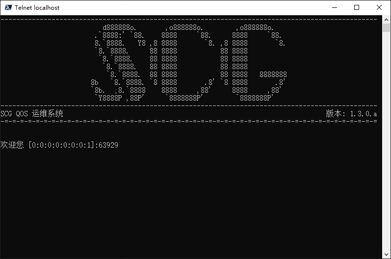
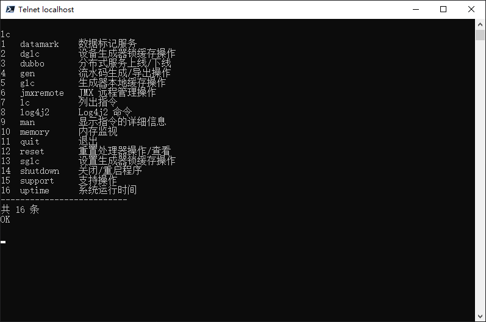

# SCG

SCG（Serial Code Generator，流水码生成器）是一款开箱即用的分布式流水码生成框架，提供标准化的流水码生成机制，
使 IT 系统能够快速实现各种流水码生成功能。

流水码生成是一个在实际应用中有着广泛需求的功能，例如以下场景：

- 订单系统中，为每个订单生成唯一的订单号（如：`ORD20250114123456`）。
- 生产系统中，为每个产品生成唯一的序列号（如：`PROD20250114-01-000123`）。
- 日志系统中，为每条日志生成唯一的追踪 ID（如：`TRACE20250114-000001`）。

SCG 以 `流水码生成设置(ScgSetting)` 为核心，可以维护大量流水码生成设置，其中对每个设置可以分别配置生成器类型，
进而实现不同的流水码生成逻辑。

SCG 为 `生成器(Generator)` 等逻辑封装了标准的接口，并维护了这些接口的调用逻辑，用户只需实现这些接口，
即可将其逻辑接入 SCG 中。

SCG 内置了 Groovy 脚本生成器等多种常用的生成器类型，用户可以直接使用这些类型；
同时，SCG 也提供了 SPI 机制，用户可以将其自定义的生成器封装为 jar 包并放置在插件目录下， 即可被 SCG 自动发现并使用。

SCG 支持分布式部署，通过粒度级别（Granularity）机制，可以灵活控制流水码生成的并发性和唯一性：

- **设置级别（SETTING）**：在同一个设置下，流水码全局唯一，适合顺序敏感且频率不高的场景。
- **设备级别（DEVICE）**：在同一个设备下，流水码唯一，不同设备可并行生成，适合顺序不敏感且频率较高的场景。

---

## 特性

- 实现标准化的流水码生成框架，内置多种接口实现流水码生成的标准化生成逻辑。
- 支持多种生成器类型，包括 Groovy 脚本生成器等，支持用户自定义生成器。
- 粒度级别机制，支持设置级别和设备级别两种粒度，灵活控制流水码生成的并发性和唯一性。
- 事件推送机制，支持执行事件的实时推送，便于下游系统进行后续处理。
- 提供 Telqos 运维平台，能够在没有 GUI 的环境下使用本服务的功能。
- 支持主流关系型数据库（基于 Hibernate）。
- 支持分布式部署。

## 文档

该项目的文档位于 [docs](../../../docs) 目录下，包括：

### wiki

wiki 为项目的开发人员为本项目编写的详细文档，包含不同语言的版本，主要入口为：

1. [简介](./Introduction.md) - 即本文件。
2. [目录](./Contents.md) - 文档目录。

## 运行截图

Telnet 运维平台 banner：

Telnet 运维平台指令合集：

